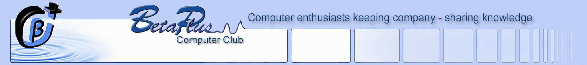
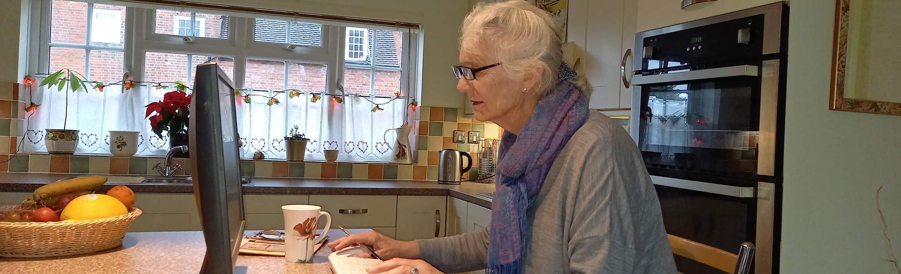

```{=html}
<!-- Hero: BetaPlus banner -->
<div class="hero-wrapper">
  <picture>
    <source media="(max-width: 640px)" srcset="pf-banner-512.jpg">
    <source media="(max-width: 1280px)" srcset="pf-banner-1024b1.jpg">
    
  </picture>
  <div class="hero-buttons">
    <a href="https://betaplus.org.uk/login" class="btn btn-primary">Login</a>
    <a href="https://betaplus.org.uk/join" class="btn" style="background-color:#21BECE;color:#fff;">Join</a>
  </div>
</div>
<!-- Janet photo -->
<div class="photo-wrapper">
  <picture>
    <source media="(max-width: 640px)" srcset="janet3-512x280.jpg">
    <source media="(max-width: 1280px)" srcset="janet3-1024x430.jpg">
    
  </picture>
</div>
```

<div class="content-section">

## Upcoming Events {.section-heading}

| Date       | Event                    |
|------------|--------------------------|
| Tue 24 Mar | Tinkers Study Group      |
| Wed 25 Mar | Club Social Chat         |
| Tue 31 Mar | Club Meeting             |
| Tue 7 Apr  | Club Social Chat         |
| Wed 8 Apr  | Apple Study Group        |
| Fri 10 Apr | Web Study Group          |
| Tue 14 Apr | Club Meeting             |

## The Club {.section-heading}

```{=html}
<div class="accordion" id="accordionClub">

  <div class="accordion-item">
    <h2 class="accordion-header">
      <button class="accordion-button" type="button" data-bs-toggle="collapse" data-bs-target="#club1">
        About the Club
      </button>
    </h2>
    <div id="club1" class="accordion-collapse collapse show" data-bs-parent="#accordionClub">
      <div class="accordion-body">
        <p>BetaPlus Computer Club was established in 2002 and has around 100 members. We welcome everyone from complete beginners through to experienced enthusiasts. Our aim is to help members get more out of their computers, tablets, and smartphones in a friendly, relaxed environment.</p>
      </div>
    </div>
  </div>

  <div class="accordion-item">
    <h2 class="accordion-header">
      <button class="accordion-button collapsed" type="button" data-bs-toggle="collapse" data-bs-target="#club2">
        When and where?
      </button>
    </h2>
    <div id="club2" class="accordion-collapse collapse" data-bs-parent="#accordionClub">
      <div class="accordion-body">
        <p>Main club meetings are held <strong>fortnightly on Tuesdays</strong>, from October through to June, at the <strong>Chichester Yacht Club</strong>. Study groups meet monthly, usually on weekday mornings. See the events list above for the next dates.</p>
      </div>
    </div>
  </div>

  <div class="accordion-item">
    <h2 class="accordion-header">
      <button class="accordion-button collapsed" type="button" data-bs-toggle="collapse" data-bs-target="#club3">
        What does it cost?
      </button>
    </h2>
    <div id="club3" class="accordion-collapse collapse" data-bs-parent="#accordionClub">
      <div class="accordion-body">
        <p>The annual membership fee is <strong>&pound;55</strong>, running from September to June. This covers all main meetings and study group sessions throughout the year.</p>
      </div>
    </div>
  </div>

  <div class="accordion-item">
    <h2 class="accordion-header">
      <button class="accordion-button collapsed" type="button" data-bs-toggle="collapse" data-bs-target="#club4">
        Is BetaPlus a charity?
      </button>
    </h2>
    <div id="club4" class="accordion-collapse collapse" data-bs-parent="#accordionClub">
      <div class="accordion-body">
        <p>Yes. BetaPlus Computer Club is a registered charity, number <strong>1105164</strong>. As a not-for-profit organisation, all funds go directly towards running the club for the benefit of members.</p>
      </div>
    </div>
  </div>

</div>
```

## Main Programme {.section-heading}

```{=html}
<div class="accordion" id="accordionProg">

  <div class="accordion-item">
    <h2 class="accordion-header">
      <button class="accordion-button" type="button" data-bs-toggle="collapse" data-bs-target="#prog1">
        Upcoming meetings
      </button>
    </h2>
    <div id="prog1" class="accordion-collapse collapse show" data-bs-parent="#accordionProg">
      <div class="accordion-body">
        <ul>
          <li><strong>Tue 31 Mar</strong> &mdash; Member showcase: favourite apps and gadgets</li>
          <li><strong>Tue 14 Apr</strong> &mdash; Q&amp;A session: your questions answered</li>
          <li><strong>Tue 28 Apr</strong> &mdash; Staying safe online: passwords and scams</li>
          <li><strong>Tue 13 May</strong> &mdash; AI tools for everyday use</li>
        </ul>
      </div>
    </div>
  </div>

  <div class="accordion-item">
    <h2 class="accordion-header">
      <button class="accordion-button collapsed" type="button" data-bs-toggle="collapse" data-bs-target="#prog2">
        Past meetings
      </button>
    </h2>
    <div id="prog2" class="accordion-collapse collapse" data-bs-parent="#accordionProg">
      <div class="accordion-body">
        <ul>
          <li><strong>Tue 11 Mar</strong> &mdash; Smart home devices: getting started</li>
          <li><strong>Tue 25 Feb</strong> &mdash; Introduction to cloud storage</li>
          <li><strong>Tue 11 Feb</strong> &mdash; Making the most of your smartphone camera</li>
          <li><strong>Tue 28 Jan</strong> &mdash; Annual general meeting</li>
        </ul>
      </div>
    </div>
  </div>

</div>
```

## Study Groups {.section-heading}

```{=html}
<div class="accordion" id="accordionGroups">

  <div class="accordion-item">
    <h2 class="accordion-header">
      <button class="accordion-button collapsed" type="button" data-bs-toggle="collapse" data-bs-target="#sg1">
        Apple Study Group
      </button>
    </h2>
    <div id="sg1" class="accordion-collapse collapse" data-bs-parent="#accordionGroups">
      <div class="accordion-body">
        <p>For Mac, iPhone, and iPad users of all levels. We cover tips, troubleshooting, and new features as Apple releases them. <strong>Next meeting: Wed 8 Apr.</strong></p>
      </div>
    </div>
  </div>

  <div class="accordion-item">
    <h2 class="accordion-header">
      <button class="accordion-button collapsed" type="button" data-bs-toggle="collapse" data-bs-target="#sg2">
        AI Study Group
      </button>
    </h2>
    <div id="sg2" class="accordion-collapse collapse" data-bs-parent="#accordionGroups">
      <div class="accordion-body">
        <p>Exploring artificial intelligence tools available to everyday users, including ChatGPT, image generators, and AI assistants. No technical background required. <strong>Next meeting: TBC.</strong></p>
      </div>
    </div>
  </div>

  <div class="accordion-item">
    <h2 class="accordion-header">
      <button class="accordion-button collapsed" type="button" data-bs-toggle="collapse" data-bs-target="#sg3">
        Digital Photography Study Group
      </button>
    </h2>
    <div id="sg3" class="accordion-collapse collapse" data-bs-parent="#accordionGroups">
      <div class="accordion-body">
        <p>From taking better photos to editing and sharing them, this group covers all aspects of digital photography. All cameras and skill levels welcome. <strong>Next meeting: TBC.</strong></p>
      </div>
    </div>
  </div>

  <div class="accordion-item">
    <h2 class="accordion-header">
      <button class="accordion-button collapsed" type="button" data-bs-toggle="collapse" data-bs-target="#sg4">
        Technical Study Group
      </button>
    </h2>
    <div id="sg4" class="accordion-collapse collapse" data-bs-parent="#accordionGroups">
      <div class="accordion-body">
        <p>A deeper dive into how computers work, networking, Raspberry Pi projects, and more. Suited to members who enjoy getting hands-on. <strong>Next meeting: TBC.</strong></p>
      </div>
    </div>
  </div>

  <div class="accordion-item">
    <h2 class="accordion-header">
      <button class="accordion-button collapsed" type="button" data-bs-toggle="collapse" data-bs-target="#sg5">
        Tinkers Study Group
      </button>
    </h2>
    <div id="sg5" class="accordion-collapse collapse" data-bs-parent="#accordionGroups">
      <div class="accordion-body">
        <p>For those who like to experiment and build: hardware projects, home automation, and creative computing. <strong>Next meeting: Tue 24 Mar.</strong></p>
      </div>
    </div>
  </div>

  <div class="accordion-item">
    <h2 class="accordion-header">
      <button class="accordion-button collapsed" type="button" data-bs-toggle="collapse" data-bs-target="#sg6">
        Web Study Group
      </button>
    </h2>
    <div id="sg6" class="accordion-collapse collapse" data-bs-parent="#accordionGroups">
      <div class="accordion-body">
        <p>Website design, WordPress, and making the most of online tools. Suitable for beginners wanting to build their first site through to those developing more complex projects. <strong>Next meeting: Fri 10 Apr.</strong></p>
      </div>
    </div>
  </div>

</div>
```

</div>

```{=html}
<footer class="site-footer">
  <a href="https://betaplus.org.uk/login">Login</a>
  &bull;
  <a href="https://betaplus.org.uk/contact">Contact Us</a>
  &bull;
  <a href="https://betaplus.org.uk/privacy">Privacy</a>
  <p style="margin-top:0.5rem;margin-bottom:0;">&copy; 2025 BetaPlus Computer Club. Registered Charity 1105164.</p>
</footer>
```
